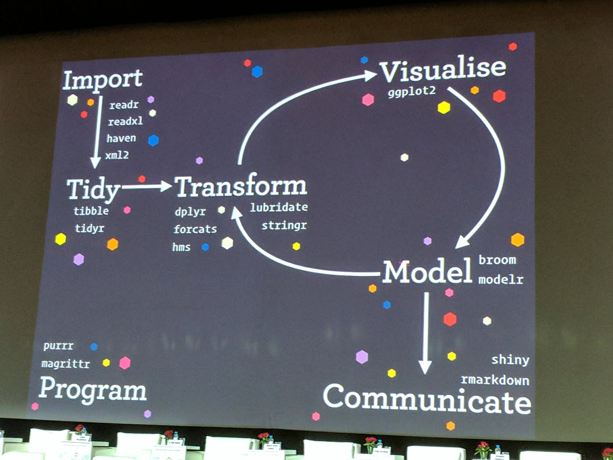

```{r setup, include=FALSE}
knitr::opts_chunk$set(echo = FALSE)
```
```{r load-packages, include=FALSE}
library(tidyverse)
library(knitr)
library(rmarkdown)
library(rlang)
```
# Outline 

- Introduction
- Transforming data with `dplyr`
- Wrangling data with `tidyr`
- Creating our own functions
- Iterating with for loops
---
# The importance of tidying your data
- Making sure your data is ready before analysis could save you a lot of headaches

> Data scientists according to interviews and expert estimates spend from 50% to 80% of their time mired in the mundane labour of collecting and preparing data, before it can be explored for useful information - New York Times (2014)

- Biological science data isn't much of an issue
  - Already tabulated
  - Working with images could be tricky
  - Not as diverse

- The need for tools that can deal with tons of data has led to the creation of packages that are simple to use and understand for humans
  - High-level programming uses natural language elements that are more understandable
- The process of removing or adding columns, edit and clean the data is called **data wrangling**

---
# What is Tidy Data?
- The concept of tidy data is very simple, put variables in columns and observations in rows


- Making data tidy is critical, instead of building analyses around whatever weird format the data is in
- Once the data is tidy, we can use a growing assortment of powerful analytical and visualization tools
---
# What is Tidy Data?
## The Tidyverse ecosystem


---
# Setup

- Start a new session, or open the previous one
- Open a new R script file
- Load the `tidyverse` package
```{r, echo = TRUE, comment=""}
## install.packages("tidyverse")
## library(tidyverse)
```
- We will work with the Gapminder data. You can download the file from the github repository. Make sure to add it to your current session
-Or you can take the url directly from github and write it to the `read_csv()` function. Remember to put it it between quotes
---

# Exploring the Gapminder dataframe
```{r, comment="", echo=TRUE, tidy=TRUE, message=FALSE}
gapminder <- read_csv("gapminder.csv")
head(gapminder) # shows the top 6 using head(gapminder,10) would show the top 10 instead
tail(gapminder) # shows the last 6
```
---
# Exploring the Gapminder dataframe
-Overall statistical overview of the Gapminder dataset
```{r, echo = TRUE, comment=""}
summary(gapminder)
```
---
# *dplyr()* Basics
- We saw some functions in the previous workshop, but here we will list the most important 
- `filter()`: picks observations by their values. Subset by **rows**
- `select()`: pick variables by their names. Subset by **columns**
- `mutate()`: create new variables with functions of existing variables. **Create** new columns
- `summarise()`: collapse many values down to a single summary. 
- `arrange()` : reorder rows, ascending or descending
- All these functions work similarly
  - first argument is the dataframe: `filter(dataframe,)`
  - Subsequent arguments describe what to do. Call specific columns, use logical expressions, etc
  - The final result is a new dataframe
---
# *dplyr()* Basics
## The `filter()` function
- We saw filter being used previously. This function will select *rows* by evaluating a certain logical expression
- Visually this is what `filter()` is doing


---
# *dplyr()* Basics
## The `filter()` function
- Here we apply two conditions: only countries that have Peru and Mexico in their rows and when life expectancy was less than 60 years old
```{r, echo = TRUE, comment=""}
filter(gapminder, country %in% c("Mexico", "Peru"), lifeExp < 60)
```
---
# *dplyr()* Basics
## The `select()` function
- `select()` is used to subset the data on variables or columns. 
- Visually this is what `select()` is doing

---
# *dplyr()* Basics
## The `select()` function
```{r, echo = TRUE, comment=""}
select(gapminder, year, country, lifeExp)
```
---
# *dplyr()* Basics
## Combining `select()` and `filter()`
- We can combine both functions to produce custom tables that reflect our needs
```{r, echo = TRUE, comment=""}
gap_cambodia  <- filter(gapminder, country == "Cambodia")
gap_cambodia  <- select(gap_cambodia, -continent, -lifeExp) 
head(gap_cambodia)
```
- As we add more functions it becomes cumbersome to keep track of all of them.
- The pipe `%>%` aims to simplify this by stringing several function operations in a single one
---
# *dplyr()* Basics
## Using `%>%` 
- Shortcuts for the pipe operator are Ctrl + Shift + M for Windows and Cmd + Shift + M for Mac
- In using the pipe operator, you start with the data before you say what you are going to do.
- Converting our previous example using `%>%` means the same as saying:
  - Take the `gapminder` data, filter only the Countries that are equal to Cambodia, then do not select the Columns `continent` or `lifeEx`. Then save the results in the variable `gap_cambodia`
```{r, echo = TRUE, comment=""}
gap_cambodia  <- gapminder %>% 
  filter(country == "Cambodia") %>%
  select(-continent, -lifeExp)
```
---
# *dplyr()* Basics
## The `mutate()` function 
- If we need to add a column using data from other columns, we can use the `mutate()` function to accomplish that.

---
# *dplyr()* Basics
## The `mutate()` function 
- Calculate each country's annual GDP which is the multiplication of population by GDP per capita
- We create a new column called `gdp`
- The variable was not saved anywhere.
- The `head()` function at the end limits the data displayed in our output
```{r, echo = TRUE, comment=""}
gapminder %>% 
  mutate(gdp = pop * gdpPercap) %>% head()
```
---
# *dplyr()* Basics
## The `mutate()` function 
- Select Asian and European countries, between the years 2005 and 2007 inclusively. 
- Calculate the population in the thousands and select only columns country, year, and the new column
```{r, echo = TRUE, comment=""}
gapminder %>%
  filter(continent %in% c("Asia", "Europe"),
         between(year, 2005, 2007)) %>%
  mutate(pop_thousands = pop/1000) %>%
  select(country, year, pop_thousands) %>% head()
```
---
# *dplyr()* Basics
## The `group_by()` function 
- The `group_by()` function takes and existing table and converts it into a grouped table where operations are performed "by group". Use `ungroup()` to remove grouping. 
- The function creates a grouping variable

---
# *dplyr()* Basics
## The `group_by()` function 
- We set the grouping variable to `continent` then create a new column called `cont_pop` that will add upp all country populations by their associated continents
- At the end we have the sum of the total population for each continent from which that country is part of in 2002
```{r, echo = TRUE, comment=""}
gapminder %>%
  filter(year == 2002) %>%
  group_by(continent) %>% 
  mutate(cont_pop = sum(pop)) %>% head()
```
---
# *dplyr()* Basics
## Distilling information with `summarize()`
- If we don't want the other columns and we just want their population total, we use the `summarize()` function
- `summarize()` will create a new dataframe. It will have one, or more rows for each combination of grouping variables. It will contain one column for each grouping varialbe and one column for each of the summary statistics specified
- Some useful summary statistics that can be used in `summarize()` include `mean()`,`median()`,`sd()`,`IQR()`,`min()`,`max()`,`n()`. 

---
# *dplyr()* 
## Distilling information with `summarize()`
- The following will filter the population in each continent in 2002 by adding the individual countries that fall into that group. 
- We apply an ungroup to remove the grouping variable so that we can do more work with it later on. 
```{r, echo = TRUE, comment=""}
gapminder %>%
  filter(year == 2002) %>%
  group_by(continent) %>% 
  summarize(cont_pop = sum(pop)) %>% ungroup() %>% head()
```
---
# *dplyr()* 
## `summarize()` and then `arrange()` its order
- We can group by and do summary for more than one column
- We then want to see the table in ascending order for `year`. Currently it is ordered alphabetically
```{r, echo = TRUE, comment=""}
gapminder %>%
  group_by(continent, year) %>%
  summarize(cont_pop = sum(pop))%>%
  ungroup() %>%
  arrange(year) %>%
  head() 
```
---
# *dplyr()* 
## Example
- What is the maximum GDP per continent across all years?
```{r, echo = TRUE, comment=""}
gapminder %>%
  group_by(continent, year) %>% #Select grouping variables
  mutate(gdp = pop * gdpPercap) %>% #Create a new column
  summarize(max_gdp = max(gdp)) %>% #Show only the columns based on grouping variables 
  # and a summary statistic
  arrange(year) %>% #arrange by the year
  head()
```
---
# Reshaping data with *tidyr()* 
- Now we have some experience with data that is in a tidy way.
- However most real data doesn't start off like that and requires some reshaping to become tidy
- `tidyr` is for reshaping data. It is less commonly use than `dplyr` but is still good to know how to use both
.center[]

---
# Reshaping data with *tidyr()* 
What's the advantage of "tidying" up the data?
1. Having a consistent data structure, makes it easy to learn the tools that work with it because they have an underlying uniformity
  - Data is often stored in a way that makes entry easy
2. Most built-in R functions work with vectors of values.
  - Remember the principles of tidy data: each variable is its own column, each observation its own row, and each value must have its own cell
.center[]

---
# Spreading and Gathering
- A common problem is a dataset where some of the column names are not names of variables bu values of a variable.
  - Ex: Columns for several timepoints of one observation.
  - Years spread into different columns
- A dataset like this needs to gather those columns into a new pair of variables
```{r, comment="", echo=TRUE, tidy=TRUE, message=FALSE}
gapminder_wide <- read_csv('gapminder_wide.csv')
colnames(gapminder_wide)
```

---
# Spreading and Gathering
- The function `gathering()` allows us to convert data from a **wide** format into a **long** format or vice versa.
  - A long format is preferred when using `ggplot` visualizations
- In our example, we wish to keep `country` and `continent` columns and create a new column that takes the spread variable into one. This is called a *key*. 
- We want to create three columns that hold `gdpPercap`, `lifeExp` and `pop` as variables and 
---

# Spreading and Gathering
```{r, echo = TRUE, comment=""}
gap_long <- gapminder_wide %>% 
  gather(key = 'year', value = 'observations')
head(gap_long)
tail(gap_long, n=4)
```
---
# Spreading and Gathering
- Selecting all the columns one by one would take a lot of work, instead we can use the `starts_with()` function from `dplyr` that looks for variables that start with the desired character string. 
```{r, echo = TRUE, comment=""}
gap_long <- gapminder_wide %>% 
  gather(key = year, value = observations, 
         starts_with('pop'),
         starts_with('lifeExp'),
         starts_with('gdpPercap')) #listing all the columns to use in gather
head(gap_long)
```
---
# Spreading and Gathering
- Alternatively we can accomplish almost the same by ignoring the `country` and `continent` columns from being included in the `gather()` function. 
```{r, echo = TRUE, comment=""}
gap_long <- gapminder_wide %>% 
  gather(key   = year,
         value = observations,
         -continent, -country)
head(gap_long)
```
---
# Spreading and Gathering
- Everything is looking good, however there is a little problem. The column `year` doesn't contain only the year but also the observation type. We can use `separate()` to split the character strings into variables.
```{r, echo = TRUE, comment=""}
gap_long <- gap_long %>%
  separate(year, #pick the column we want to separate
           into = c('obs_type', 'year'), #Creates two columns
           sep = "_", # assigns the character separator
           convert = TRUE)#this ensures that the year column is an integer rather than a character
head(gap_long)
```
---
# Spreading and Gathering
- `spread()` is essentially the opposite of `gather()`. It transforms data from long to wide format. 
```{r, echo = TRUE, comment=""}
gap_wide_again <- gap_long %>% 
  unite(col = var_names, obs_type, year, sep = "_") %>% 
  #Unite(), the opposite of separate.
  #unite obs_type and year into a new column called var_names. Separate by _
  spread(key = var_names, value = observations)# Spread var_names out by key_value pair
colnames(gap_wide_again)
```
---
# An Introduction to Functions
- One of the best ways to improve our code is to write functions. 
- Functions allow you to automate common tasks in a more powerful and general way than copy-and-pasting.
- You should consider writing a function whenever you’ve copied and pasted a block of code more than twice (i.e. you now have three copies of the same code)
<center>

</center>
Key Steps:
1. Pick a *name* for the function
2. List the inputs or *arguments*, to the functions
3. Place the code you have developed in *body* of the function
---
# An Introduction to Functions
```{r, echo = TRUE, comment=""}
sum <- function(x,y){
  return(x + y)
}
sum(4,3)
sum(1,3)
sum(5,6)
```
---
# An Introduction to Functions
- We can return multiple values by saving the results in a vector or list and then return it
- The function will return the last statement by default
```{r, echo = TRUE, comment=""}
math_fn <- function(x,y){
  add <- x + y
  sub <- x - y
  mul <- x * y
  div <- x / y
  c(addition = add, subtraction = sub,
    multiplication = mul, divisions = div)
}

math_fn(20, 6)
```
---
# Using functions in datasets
- Let's look at the `mtcars` dataset that is included in R
- The data was extracted from the 1974 Motor Trend US magazine, and comprises fuel consumption and 10 aspects of automobile design and performance for 32 automobiles
```{r, echo = TRUE, comment=""}
data(mtcars)
str(mtcars)
```
---
# Using functions in datasets
- Group the cars by cylinder and calculate the mean for miles per gallon for all the cars with their respective cylinder. 
```{r, echo = TRUE, comment=""}
mtcars %>%
  group_by(cyl) %>%
  summarize(mean_mpg =mean(mpg))
```
---
# Using functions in datasets
- We can build a function that can perform these two steps in one, not just for this dataset but for any other we would like to execute a `group_by` followed by a `summarize`
- The function takes arguments that will then be passed on to the body of the function. However because we want to keep it dynamic, we need to tweak a few things using `enquo()` from the `rlang` package. Arguments act as placeholders
```{r, echo = TRUE, comment="", message=FALSE}
#make sure to load the rlang library to use enquo library(rlang)
simple_fn <- function(data., col_name){
  col_name <- enquo(col_name)
data. %>%
  group_by(!!col_name) %>%
  summarize(mean = mean(mpg))
}
mtcars %>% simple_fn(cyl)
```
---
# Making it more dynamic
- So far our function will take a dataset and a column of your choosing to provide you with grouped summary statistics
- We can expand this and add more than just the mean of `mpg` 
```{r, echo = TRUE, comment="", message=FALSE}

dynamic_fn <- function(data., group_col, ...){
  col_name <- enquo(group_col)
  col_vars <- quos(...)
data. %>%
  group_by(!!col_name) %>%
  summarise_at(vars(!!!col_vars), list(mean = mean,sd = sd, min = min, max = max))
}
mtcars %>% dynamic_fn(cyl, hp, wt, mpg) #Arguments are: column you wish to group by and then the columns you wish to do the summary statistics on
```

---
# Using for loops 
- Functions are great help for reducing duplication. Combine functions with *iteration* and then it helps us saving time on repeating the same thing on multiple inputs.
- The `for` statement will iterate (perform an operation) over the items of a vector or a list. The items are iterated in the order that they appear in the vector
<center>

</center>
```{r, echo = TRUE, comment=""}
colours <- c("red", "green", "blue", "yellow")
for (color in colours){
  print(color)
}
```

---
# Using for loops
```{r, echo = TRUE, comment=""}
for (x in seq(from=2,to=14,by=2)) { #The seq() function creates a list from 2 to 14 going up every 2 numbers
  print(x^2) #Each number in this generated list will be raised to the power of 2
}
```
---
# Combining functions and loops using the `purrr` package
- Purrr introduces map functions as well as some new functions for manipulating lists.
- `map()` will take a vector and a function, call the function once for each element of the vector, and return the results in a list
<center>

</center>
